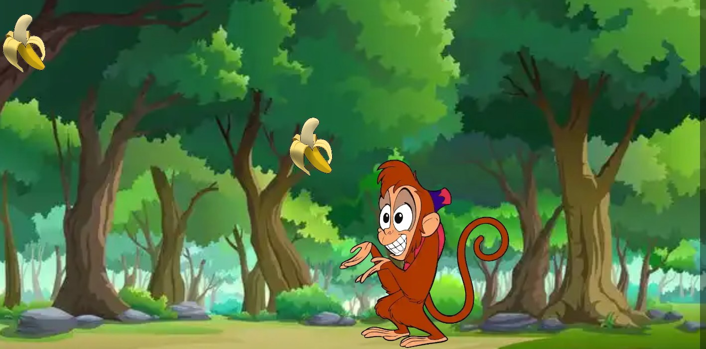

<h1>Feed Dah Monkey</h1>
<h2>This programme is part of a bigger project.</h2>

There are a number of issues this code base solves:

<ol>
  <li>Making a responsive background image that always has an aspect-ratio of 2:1 regardless of the screen dimensions</li>
  <li>Being able to drag images onto the background and place them on the background so that they keep their position even when resizing the screen</li>
  <li>Adding new images to the DOM without having to loop through existing images</li>
  <li>Effectively removing images from the DOM</li>
  <li>Keeping images fixed within the bounds of the background when dragging</li>
  <li>Making the dragged banana image aware of the monkey's position when being dragged</li>
  <li>And a couple of other little things...</li>
</ol>
<h3>How it works</h3>

Drag the banana on the top left to anywhere on the background.

When you drop the banana it will stay where you placed it and another banana will appear at the top left.

You can drag the monkey as well and add as many bananas to the background as you like.

To remove a banana drag it towards the monkey's face. You will notice the image backgrounds changing colour. Drop the banana while the backgrounds are red and blue and the banana image will be removed from the DOM.

